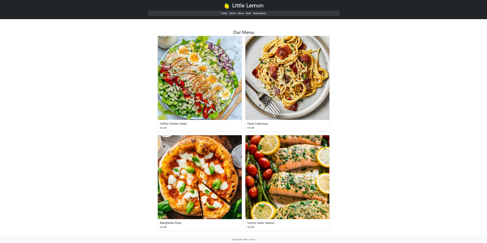

# Little Lemon Reservation System

This project is a simple reservation system for a fictional restaurant called Little Lemon. It is a part of the Coursera Full Stack Developer assignment. The system allows users to make reservations, view all reservations in JSON format, and dynamically load reservations for a selected date.

## Features

- **Make Reservations:** Users can enter their name, select a date and time, and make a reservation.
- **View All Reservations:** Displays all reservations in a structured format, ordered by date and time.
- **Dynamic Date Selection:** Users can select a date to view all reservations for that specific day.

## Technologies Used

- **Backend:** Django
- **Frontend:** Bootstrap
- **Database:** SQLite (default Django configuration)

## Screenshots

### Menu Page


### Make a Reservation


### View All Reservations


## Getting Started

### Prerequisites

- Python 3.x
- Django
- pipenv (for virtual environment management)

### Installation

1. Clone the repository:
   ```sh
   git clone <repository_url>
2. Navigate to the project directory:
   ```sh
   cd littlelemon
3. Create and activate a virtual environment
   ```sh
   pipenv install
   pipenv shell
4. Install the required packages:
   ```sh
   pip install django
5. Apply the migrations:
   ```sh
   python manage.py migrate
6. Run the development server:
   ```sh
   python manage.py runserver
## Usage

- Access the application at `http://127.0.0.1:8000/`.
- Use the navigation bar to switch between the Home, About, Menu, Book, and Reservations pages.
- On the "Make a Reservation" page, enter the required details and click "Reserve" to make a reservation.
- The "All Reservations" page displays all reservations in JSON format.
- Selecting a date on the "Make a Reservation" page dynamically loads reservations for that date.

## License

MIT License

Permission is hereby granted, free of charge, to any person obtaining a copy
of this software and associated documentation files (the "Software"), to deal
in the Software without restriction, including without limitation the rights
to use, copy, modify, merge, publish, distribute, sublicense, and/or sell
copies of the Software, and to permit persons to whom the Software is
furnished to do so, subject to the following conditions:

The above copyright notice and this permission notice shall be included in all
copies or substantial portions of the Software.

THE SOFTWARE IS PROVIDED "AS IS", WITHOUT WARRANTY OF ANY KIND, EXPRESS OR
IMPLIED, INCLUDING BUT NOT LIMITED TO THE WARRANTIES OF MERCHANTABILITY,
FITNESS FOR A PARTICULAR PURPOSE AND NONINFRINGEMENT. IN NO EVENT SHALL THE
AUTHORS OR COPYRIGHT HOLDERS BE LIABLE FOR ANY CLAIM, DAMAGES OR OTHER
LIABILITY, WHETHER IN AN ACTION OF CONTRACT, TORT OR OTHERWISE, ARISING FROM,
OUT OF OR IN CONNECTION WITH THE SOFTWARE OR THE USE OR OTHER DEALINGS IN THE
SOFTWARE.

## Acknowledgements

- This project was created as part of the Coursera Full Stack Developer assignment.
- Thanks to all Coursera instructors and fellow students for their support and inspiration.

## Contact

For any questions or feedback, please contact Ryan at ryantoronto7@gmail.com.


